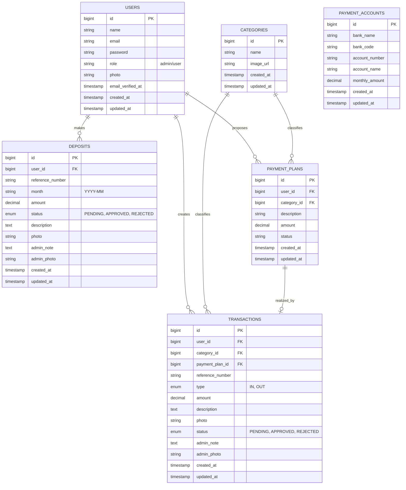

# Entity Relationship Diagram (ERD) - MKAS Laravel

Dokumen ini menjelaskan struktur basis data dan hubungan antar entitas dalam aplikasi MKAS.

## Diagram (Mermaid)

## Struktur Tabel

### 1. Users (users)

| Kolom        | Tipe Data | Deskripsi                        |
| ------------ | --------- | -------------------------------- |
| `id`         | bigint    | Primary Key                      |
| `name`       | string    | Nama lengkap pengguna            |
| `email`      | string    | Alamat email (unique)            |
| `password`   | string    | Hash password                    |
| `role`       | enum      | Peran pengguna (`admin`, `user`) |
| `photo`      | string    | Path foto profil                 |
| `created_at` | timestamp | Waktu pendaftaran                |

### 2. Categories (categories)

| Kolom        | Tipe Data | Deskripsi                        |
| ------------ | --------- | -------------------------------- |
| `id`         | bigint    | Primary Key                      |
| `name`       | string    | Nama kategori (contoh: Konsumsi) |
| `image_url`  | string    | URL ikon/gambar kategori         |
| `created_at` | timestamp | Waktu pembuatan                  |

### 3. Payment Accounts (payment_accounts)

| Kolom            | Tipe Data | Deskripsi                     |
| ---------------- | --------- | ----------------------------- |
| `id`             | bigint    | Primary Key                   |
| `bank_name`      | string    | Nama Bank                     |
| `bank_code`      | string    | Kode Bank                     |
| `account_number` | string    | Nomor Rekening                |
| `account_name`   | string    | Nama Pemilik Rekening         |
| `monthly_amount` | decimal   | Besaran iuran wajib per bulan |

### 4. Deposits (deposits)

| Kolom              | Tipe Data | Deskripsi                                  |
| ------------------ | --------- | ------------------------------------------ |
| `id`               | bigint    | Primary Key                                |
| `user_id`          | bigint    | Foreign Key ke `users.id`                  |
| `reference_number` | string    | Kode unik (contoh: `MKASDT0001`)           |
| `month`            | string    | Bulan iuran (Format: `YYYY-MM`)            |
| `amount`           | decimal   | Nominal iuran                              |
| `status`           | enum      | Status (`PENDING`, `APPROVED`, `REJECTED`) |
| `description`      | text      | Catatan dari pengguna                      |
| `photo`            | string    | Path bukti transfer                        |
| `admin_note`       | text      | Catatan dari admin                         |
| `admin_photo`      | string    | Path bukti respon dari admin               |

### 5. Transactions (transactions)

| Kolom              | Tipe Data | Deskripsi                                    |
| ------------------ | --------- | -------------------------------------------- |
| `id`               | bigint    | Primary Key                                  |
| `user_id`          | bigint    | Foreign Key ke `users.id`                    |
| `category_id`      | bigint    | Foreign Key ke `categories.id`               |
| `payment_plan_id`  | bigint    | Foreign Key ke `payment_plans.id` (nullable) |
| `reference_number` | string    | Kode unik (`MKASIN...` atau `MKASOUT...`)    |
| `type`             | enum      | Jenis (`IN`, `OUT`)                          |
| `amount`           | decimal   | Nominal transaksi                            |
| `description`      | text      | Keterangan transaksi                         |
| `photo`            | string    | Path bukti foto transaksi                    |
| `status`           | enum      | Status (`PENDING`, `APPROVED`, `REJECTED`)   |
| `admin_note`       | text      | Catatan dari admin                           |
| `admin_photo`      | string    | Path bukti respon dari admin                 |

### 6. Payment Plans (payment_plans)

| Kolom         | Tipe Data | Deskripsi                                   |
| ------------- | --------- | ------------------------------------------- |
| `id`          | bigint    | Primary Key                                 |
| `user_id`     | bigint    | Foreign Key ke `users.id`                   |
| `category_id` | bigint    | Foreign Key ke `categories.id`              |
| `description` | string    | Rencana pengeluaran                         |
| `amount`      | decimal   | Estimasi biaya                              |
| `status`      | string    | Status rencana (`PENDING`, `APPROVED`, dsb) |

## Hubungan (Relationships)

1.  **User ke Deposits/Transactions/Payment Plans**: Satu pengguna dapat memiliki banyak catatan iuran, transaksi, dan rencana pembayaran (_One-to-Many_).
2.  **Category ke Transactions/Payment Plans**: Satu kategori dapat digunakan di banyak transaksi dan rencana pembayaran (_One-to-Many_).
3.  **Payment Plan ke Transaction**: Satu rencana pembayaran direalisasikan menjadi satu transaksi (_One-to-One/Optional_).
